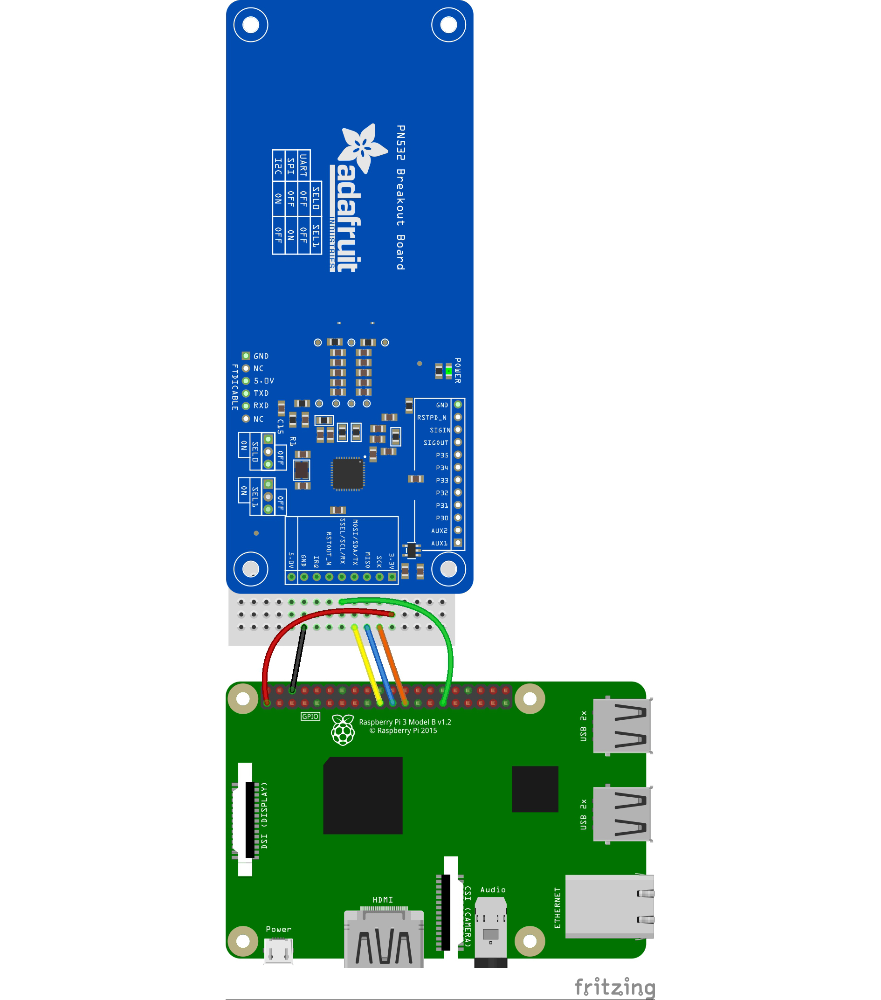

>This breakout is designed to work with I2C, SPI and UART, however I2C AND UART DO NOT WORK RELIABLY ON RASPBERRY PI. If you're using the PN532 with Raspberry Pi, use SPI!

Here's the Raspberry Pi wired with SPI:





- Pi 3V to breakout 3.3V
- Pi GND to breakout GND
- Pi MOSI to breakout MOSI
- Pi MISO to breakout MISO
- Pi SCLK to breakout SCK
- Pi D5 to breakout SSEL
 
You must set the jumpers to enable SPI on your PN532! For SPI:

- SEL0 = OFF
- SEL1 = ON


> On Raspberry Pi, you must also connect a pin to P32 "H_Request" for hardware wakeup. This avoids I2C clock stretching.

```
req_pin = DigitalInOut(board.D12)
i2c = busio.I2C(board.SCL, board.SDA)
pn532 = PN532_I2C(i2c, debug=False, reset=reset_pin, req=req_pin)
```

## Clock Stretching
> In an I2C communication, the master device determines the clock speed. Unlike RS232 the I2C bus provides an explicit clock signal which relieves master and slave from synchronizing exactly to a predefined baud rate.
> However, there are situations where an I2C slave is not able to co-operate with the clock speed given by the master and needs to slow down a little. This is done by a mechanism referred to as clock stretching.
> An I2C slave is allowed to hold down the clock if it needs to reduce the bus speed. The master, on the other hand, is required to read back the clock signal after releasing it to the high state and wait until the line has actually gone high.


## NFC Data Exchange Format (NDEF)

The NFC Data Exchange Format (NDEF) is a standardised data format that can be used to exchange information between any compatible NFC device and another NFC device or tag. The data format consists of NDEF Messages and NDEF Records. 

The NDEF format is used to store and exchange information like URIs, plain text, etc., using a commonly understood format. NFC tags like Mifare Classic cards can be configured as NDEF tags, and data written to them by one NFC device (NDEF Records) can be understood and accessed by any other NDEF compatible device. NDEF messages can also be used to exchange data between two active NFC devices in "peer-to-peer" mode. 

The NDEF standard includes numerous Record Type Definitions (RTDs) that define how information like URIs should be stored, and each NDEF device, tag or message can contained multiple RTDs.

https://learn.adafruit.com/adafruit-pn532-rfid-nfc/ndef